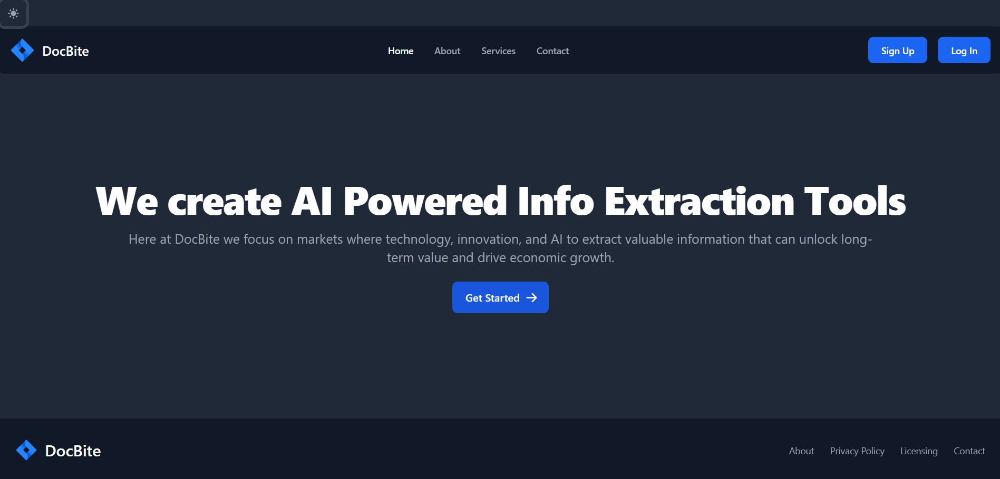
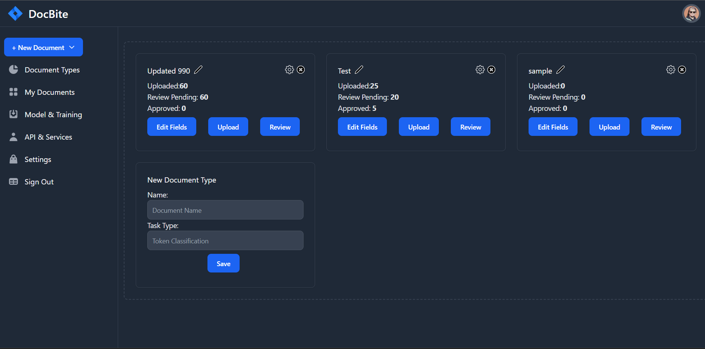
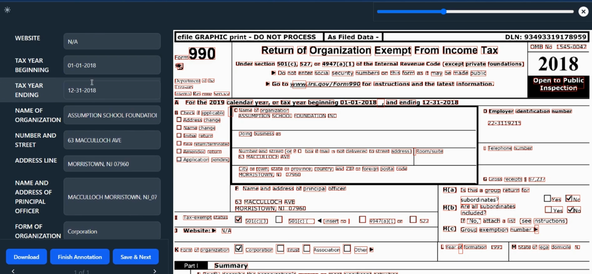
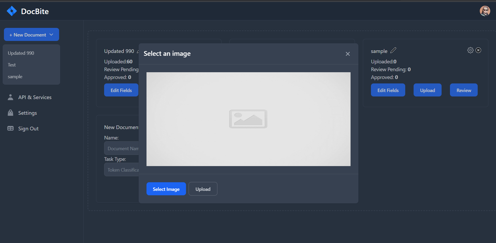
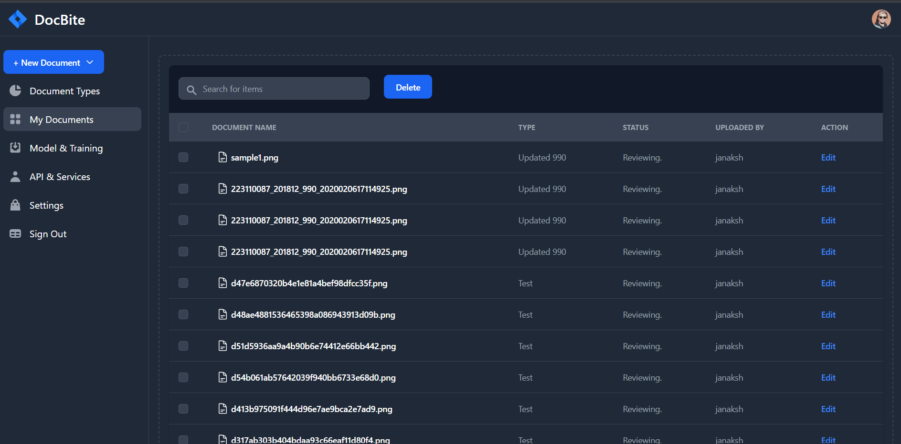

<!-- Improved compatibility of back to top link: See: https://github.com/othneildrew/Best-README-Template/pull/73 -->

<a name="readme-top"></a>

<!--
*** Thanks for checking out the Best-README-Template. If you have a suggestion
*** that would make this better, please fork the repo and create a pull request
*** or simply open an issue with the tag "enhancement".
*** Don't forget to give the project a star!
*** Thanks again! Now go create something AMAZING! :D
-->

<!-- PROJECT SHIELDS -->
<!--
*** I'm using markdown "reference style" links for readability.
*** Reference links are enclosed in brackets [ ] instead of parentheses ( ).
*** See the bottom of this document for the declaration of the reference variables
*** for contributors-url, forks-url, etc. This is an optional, concise syntax you may use.
*** https://www.markdownguide.org/basic-syntax/#reference-style-links
-->

<!-- [![Contributors][contributors-shield]][contributors-url]
[![Forks][forks-shield]][forks-url]
[![Stargazers][stars-shield]][stars-url]
[![Issues][issues-shield]][issues-url]
[![MIT License][license-shield]][license-url]
[![LinkedIn][linkedin-shield]][linkedin-url] -->

<!-- PROJECT LOGO -->
<br />
<div align="center">
  <a href="https://github.com/othneildrew/Best-README-Template">
    
  </a>

  <h3 align="center">DocBite</h3>

  <p align="center">
    DocBite is an innovative information extraction interface designed to simplify the process of extracting structured data from document forms, such as the IRS 990 Form. With DocBite, you can easily convert complex documents into JSON or CSV formats, making it easier to analyze and process the extracted information.
    <br />
    <a href="https://github.com/othneildrew/Best-README-Template"><strong>Explore the docs »</strong></a>
    <br />
    <br />
    <a href="https://github.com/othneildrew/Best-README-Template">View Video Demo</a>
    ·
    <a href="https://github.com/Janaksharma2055">Report Bug</a>
    ·
    <a href="https://github.com/Janaksharma2055">Request Feature</a>
  </p>
</div>

<!-- TABLE OF CONTENTS -->
<details>
  <summary>Table of Contents</summary>
  <ol>
    <li>
      <a href="#about-the-project">About The Project</a>
      <ul>
        <li><a href="#built-with">Built With</a></li>
      </ul>
    </li>
    <li>
      <a href="#getting-started">Getting Started</a>
      <ul>
        <li><a href="#prerequisites">Prerequisites</a></li>
        <li><a href="#installation">Installation</a></li>
      </ul>
    </li>
    <li><a href="#usage">Usage</a></li>
    <li><a href="#roadmap">Roadmap</a></li>
    <li><a href="#contributing">Contributing</a></li>
    <li><a href="#license">License</a></li>
    <li><a href="#contact">Contact</a></li>
    <li><a href="#acknowledgments">Acknowledgments</a></li>
  </ol>
</details>

<!-- ABOUT THE PROJECT -->

## About The Project

<!--
[![Product Name Screen Shot][product-screenshot]](https://example.com) -->

DocBite is a powerful information extraction tool developed to streamline the process of extracting structured data from document forms. It aims to address the challenges faced by individuals and organizations when dealing with complex forms like the IRS 990 Form, where extracting specific information can be time-consuming and error-prone.

The motivation behind DocBite stems from the need for a reliable and efficient solution that automates the extraction process, saving users valuable time and resources. By leveraging state-of-the-art algorithms and techniques, DocBite accurately analyzes document forms and extracts the relevant information, eliminating the need for manual data entry.

DocBite supports various types of document forms, with a specific focus on forms like the IRS 990 Form commonly used in the nonprofit sector. However, its flexibility allows for compatibility with other document formats as well, ensuring its usefulness across different industries and use cases.

With its intuitive user interface, DocBite provides a seamless experience for users. Uploading document forms is straightforward, and the extraction process is initiated with a few clicks. Users can choose between JSON and CSV formats for the extracted data, enabling easy integration with existing systems or further analysis using popular tools and platforms.

<!-- <p align="right">(<a href="#readme-top">back to top</a>)</p> -->

### Built With

- [![React][React.js]][React-url]
- [![TailWind][TailWind.com]][TailWind-url]
- [![FastAPI][FastAPI.com]][FastAPI-url]
- [![MongoDB][MongoDB]][MongoDB-url]

<!-- <p align="right">(<a href="#readme-top">back to top</a>)</p> -->

<!-- GETTING STARTED -->

## Getting Started

In order to get started With the project you can follow below steps

### Installation

_Follow Below Steps for installation_

1. Clone the repo

   ```sh
   git clone https://github.com/your_username_/Project-Name.git
   ```

2. Go to `Frontend` directory
3. Install NPM packages and start Frontend
   ```sh
   npm install
   npm start
   ```
4. Go to `Backend` directory
   ```python
   const API_KEY = "ENTER YOUR API";
   ```
5. Use Virtual environment of your choice(We used venv)
6. Copy `.env` file
7. Install requirements
   ```python
   python requirements.py i
   ```
8. Start backend Server
9. Go to `Backend` directory
   ```python
   python main.py
   ```

<!-- <p align="right">(<a href="#readme-top">back to top</a>)</p> -->

<!-- USAGE EXAMPLES -->

## Usage

DocBite offers a user-friendly interface that simplifies the process of extracting structured data from document forms.
_For more examples, please refer to the [Documentation](https://example.com)_

### ScreenShots

**Homepage** <br>


**Dashboard**<br>


**Annotation Page**<br>


**Document Upload** <br>


**Model and Training**<br>


**Documents**


<!-- <p align="right">(<a href="#readme-top">back to top</a>)</p> -->

<!-- ROADMAP -->

<!-- <p align="right">(<a href="#readme-top">back to top</a>)</p> -->

<!-- CONTRIBUTING -->

## Contributing

Thank you for your interest in contributing to the DocBite project. While contributions are currently closed, we appreciate your support. Stay updated for future opportunities as we may open up contributions to the community.

<!-- 1. Fork the Project
2. Create your Feature Branch (`git checkout -b feature/AmazingFeature`)
3. Commit your Changes (`git commit -m 'Add some AmazingFeature'`)
4. Push to the Branch (`git push origin feature/AmazingFeature`)
5. Open a Pull Request -->

<p align="right">(<a href="#readme-top">back to top</a>)</p>

<!-- LICENSE -->

## License

Distributed under the MIT License. See `LICENSE.txt` for more information.

<!-- <p align="right">(<a href="#readme-top">back to top</a>)</p> -->

<!-- CONTACT -->

## Contact

Janak Sharma- [LinkedIn](https://www.linkedin.com/in/janaksharma/) - janak.sharma2075@gmail.com

<!-- <p align="right">(<a href="#readme-top">back to top</a>)</p> -->

<!-- ACKNOWLEDGMENTS -->
<!--
## Acknowledgments

Use this space to list resources you find helpful and would like to give credit to. I've included a few of my favorites to kick things off!

- [Choose an Open Source License](https://choosealicense.com)
- [GitHub Emoji Cheat Sheet](https://www.webpagefx.com/tools/emoji-cheat-sheet)
- [Malven's Flexbox Cheatsheet](https://flexbox.malven.co/)
- [Malven's Grid Cheatsheet](https://grid.malven.co/)
- [Img Shields](https://shields.io)
- [GitHub Pages](https://pages.github.com)
- [Font Awesome](https://fontawesome.com)
- [React Icons](https://react-icons.github.io/react-icons/search) -->

<!-- <p align="right">(<a href="#readme-top">back to top</a>)</p> -->

<!-- MARKDOWN LINKS & IMAGES -->
<!-- https://www.markdownguide.org/basic-syntax/#reference-style-links -->

[contributors-shield]: https://img.shields.io/github/contributors/othneildrew/Best-README-Template.svg?style=for-the-badge
[contributors-url]: https://github.com/othneildrew/Best-README-Template/graphs/contributors
[forks-shield]: https://img.shields.io/github/forks/othneildrew/Best-README-Template.svg?style=for-the-badge
[forks-url]: https://github.com/othneildrew/Best-README-Template/network/members
[stars-shield]: https://img.shields.io/github/stars/othneildrew/Best-README-Template.svg?style=for-the-badge
[stars-url]: https://github.com/othneildrew/Best-README-Template/stargazers
[issues-shield]: https://img.shields.io/github/issues/othneildrew/Best-README-Template.svg?style=for-the-badge
[issues-url]: https://github.com/othneildrew/Best-README-Template/issues
[license-shield]: https://img.shields.io/github/license/othneildrew/Best-README-Template.svg?style=for-the-badge
[license-url]: https://github.com/othneildrew/Best-README-Template/blob/master/LICENSE.txt
[linkedin-shield]: https://img.shields.io/badge/-LinkedIn-black.svg?style=for-the-badge&logo=linkedin&colorB=555
[linkedin-url]: https://linkedin.com/in/othneildrew
[product-screenshot]: images/screenshot.png
[Next.js]: https://img.shields.io/badge/next.js-000000?style=for-the-badge&logo=nextdotjs&logoColor=white
[Next-url]: https://nextjs.org/
[React.js]: https://img.shields.io/badge/React-20232A?style=for-the-badge&logo=react&logoColor=61DAFB
[React-url]: https://reactjs.org/
[FastAPI.com]: https://img.shields.io/badge/FastAPI-005571?style=for-the-badge&logo=fastapi
[FastAPI-URL]: https://fastapi.tiangolo.com/lo/
[TailWind.com]: https://img.shields.io/badge/tailwindcss-%2338B2AC.svg?style=for-the-badge&logo=tailwind-css&logoColor=white
[TailWind-url]: https://tailwindcss.com/
[MongoDB]: https://img.shields.io/badge/MongoDB-%234ea94b.svg?style=for-the-badge&logo=mongodb&logoColor=white
[MongoDB-url]: https://www.mongodb.com/
